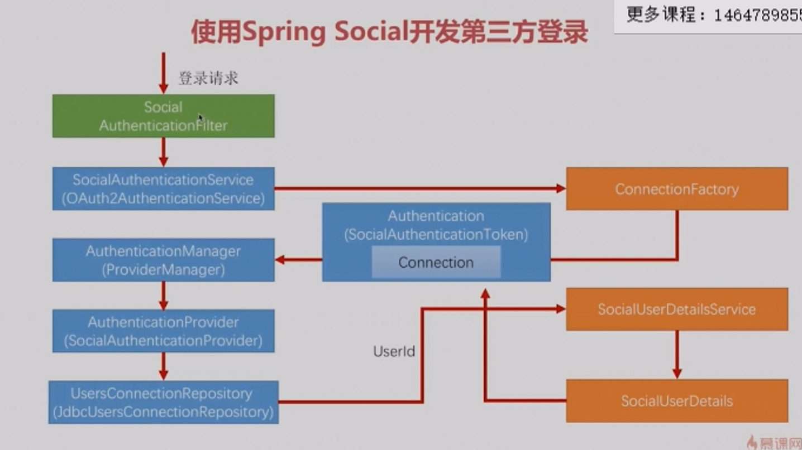

# 5-6 处理注册逻辑

* 注册逻辑
    * 如何拿到connection中的用户信息
    * 如何把从QQ中拿到的用户信息生成业务系统中用户的UserId
      (把从第三方应用QQ拿到的用户信息和客户端（demo项目）绑定在一起)
    * 把生成的UserId和QQ用户信息保存到数据库中

整个流程
* 用户登录
* 调用ConnectionFactory获取到第三方应用用户信息封装到Connection中
* 调用Provider
* 调用Repository，通过providerId和openId从数据库查询UerId，
  查不到跳转到注册界面，或者客户端直接帮助用户注册（内部实现）
* 查到UserId后通过SocialDetailsService获取到SocialUserDetails
* 把SocialUserDetails封装到Connection
* 最后发给到SecurityContext中
* 放到session

注册的内部实现
* 自定义DemoConnectionSignUp方法
* 把DemoConnectionSignUp配置到SocialConfig