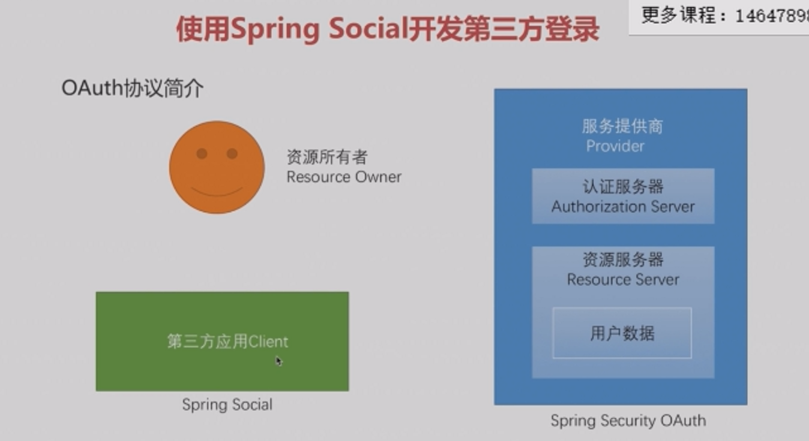

# 6-1 SpringSecurityOAuth简介

### 本章内容简介
* 实现一个标准的OAuth2协议中Provider角色的主要功能
* 重构之前的三种认证方式的代码，使其支持Token
* 高级特性

比较
* SpringSocial主要是做客户端的工作，可以快速实现客户端角色，客服端去向服务提供商获取信息，
  要去配置授权模式上的各个步骤，比如获取授权码路径，获取accesstoken，获取用户信息等。
* Spring Security OAuth，可以快速实现服务提供商角色，内部已经实现好了OAuth2的四种授权模式，
  可以把自定义的认证，使其支持Token、资源服务器的配置，
  
