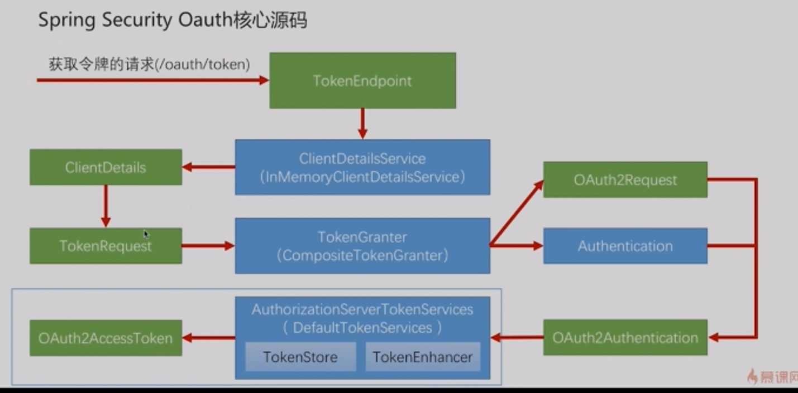

# 6-3 SpringSecurityOAuth核心源码解析

* ClientDetails封装了第三方应用的信息
* TokenEndPoint创建的TokenRequest封装了请求中的一些其它信息，并把ClientDetails也会放入其中
* OAuth2Request是对ClientDetails和TokenRequest的一个整合
* Authentication封装的是当前请求用户的一些信息
* OAuth2Authentication封装了OAuth2Request和Authentication（现在是哪个第三方应用，请求哪个用户给加你授权，哪种授权模式，参数有哪些等）
* DefaultTokenService生成token
    * TokenStore令牌存储
    * TokenEnhancer令牌增强
    